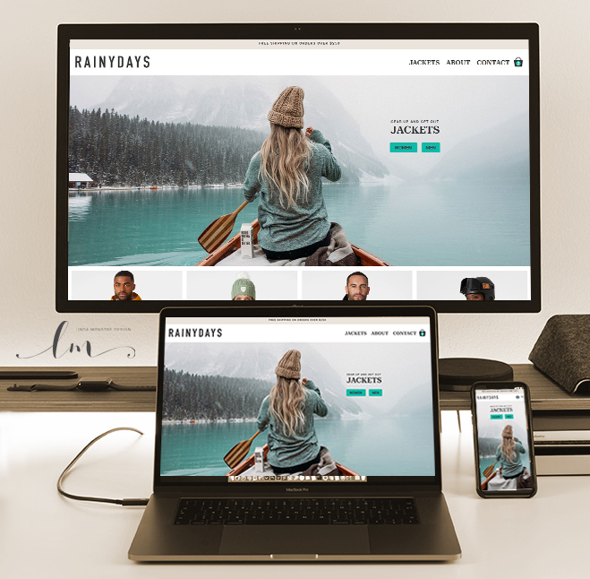

# Rainydays

An fictive online shop, selling durable and affordable jacket for grown ups.

## Noroff Course Assignment for Frontend development

## What was the brief?

In this course assignment we were given the task of developing Rainydays, our own designed prototype from last course assignment. The site should become a functional, well presented website written with HTML and CSS only. There were several criteria to be met, such as neat semantic, responsiveness and CSS after the DRY principles. We could use Flexbox and Grid where appropriate, and the site should be WCAG compliant. Accessibility should be taken into account.
We were not allowed to use framework, so I did all the coding myself.

## What was my experience and what to do next time?

After looking at my prototype in Figma, I decided that I had to change a few of the container-elements, so it would work better on all the different screen sizes. Mostly this had to do about the order of images and text, so the site would be easier to the readers.
Example: on the product-page, I took the liberty to reorder the CTA buy-button, and placed it before the illustration images of the jacket.

My site is working great on all screen sizes from 300px up to 3000px +, and with only one media query. I had to alter some of the images from 390px up to 800px, to make them better looking on tablets.
When checking my site with the WCAG, one of the colors were not compliant, so I had to tweak the color and make it a bit darker for contrast. After my opinion, this did not affect the overall design.
I had made an newsletter pop-up in Figma, which i decided to make static on some of my pages, since we are not doing Javascipt at the moment. I did some research on a CSS pop-up, but I did not like how it turned out. I would do a pop-up next time. Also, I did not plan for animation, so the only animation I have on Rainydays at the moment, lies in the hamburger menu.

I got several and great feedback from my tutor and peers, that helped me along the way, bettering my design and code.
My main concern in ths project, was my hamburger menu. I got several tips from my tutor and peers, but none of them worked. After several hours trying all kinds of tricks, Wave.webaim.org still tells me that i have an error in my navbar, and that I should add a title to my label - which i did. They stated that: "If a label is not necessary visually, a descriptive title attribute may be added to the form control."
When i put a dot in the span-area, the error disappeared, but I don't want a dot in my hamburger-menu. Better luck with Javascript, I think.

In this course assignment, I learned that next time, I will be more considerate when planning mye design and use of real estate on bigger screens. This, I think will save me a lot of time in the long run. Whit my gained experience, I also will do better choices when planning a site.
Also I will be more aware on my use of typography and what words I use to describe content in HTML and CSS, which i still find challenging.

## How i got there

- Figma / Adobe
- GitHub / VS Code
- Netlify
- Chrome Developer tools
- Google fonts
- Wave from Webaim / Validator from w3school

- HTML
- CSS

## What helped me achieve this?

- https://developer.mozilla.org/en-US/
- https://www.w3schools.com/
- https://wave.webaim.org/
- https://validator.w3.org/
- Emily Kay at LinkedIn learning
  (https://www.linkedin.com/learning/css-combining-grid-and-flexbox/functions-and-keywords?autoplay=true&u=43268076)

Images:

- https://www.hellyhansen.com/
- https://unsplash.com/

Text rewritten:

- https://www.rei.com/
- https://eu.patagonia.com/gb/en/home/

## Who helped me when i felt blue

- Kenneth Collins and Fredrik Rustad

## Want to take a look at my Rainydays?

Netlify: https://rainydays-everydayjackets.netlify.app
